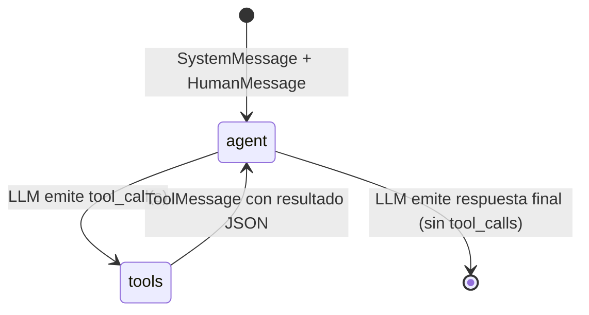

# Finance Agent — Guía de Usuario

Agente de trading que simula compra/venta de acciones usando **yfinance**, **MCP (FastMCP)**, **vLLM (local)** y **Qdrant**.

---

## Requisitos

| Componente | Requisito |
|---|---|
| Python | 3.12 (venv en `../RAG-CVs/.venv`) |
| GPU NVIDIA | ≥ 24 GB VRAM (para Qwen 32B AWQ) |
| Docker + nvidia-container-toolkit | para vLLM y Qdrant |

---

## Puesta en marcha

### 1. Infraestructura (una sola vez)

```bash
# Levantar Qdrant y vLLM
docker compose up qdrant vllm -d

# Verificar que vLLM esté listo (~10 min la primera vez, descarga el modelo)
curl http://localhost:8000/health
```

> **Nota:** vLLM descarga `Qwen/Qwen2.5-32B-Instruct-AWQ` (~20 GB) en el primer arranque.  
> Las siguientes veces usa el caché en el volumen Docker `hf_cache`.

### 2. Variables de entorno

```bash
cp .env.example .env
# Editar .env si se quieren cambiar defaults (tickers, capital, años, etc.)
```

Principales variables en `.env`:

| Variable | Default | Descripción |
|---|---|---|
| `VLLM_BASE_URL` | `http://localhost:8000/v1` | Endpoint de vLLM |
| `QDRANT_URL` | `http://localhost:6333` | Endpoint de Qdrant |
| `MODEL_NAME` | `Qwen/Qwen2.5-32B-Instruct-AWQ` | Modelo a usar |
| `TICKERS` | `AAPL,TSLA,MSFT,GOOGL,NVDA` | Acciones por defecto |
| `INITIAL_CAPITAL` | `10000.0` | Capital inicial en USD |
| `YEARS` | `3` | Años de simulación |
| `BACKTEST_INTERVAL` | `1wk` | Intervalo entre pasos |

---

## Ejecutar una simulación

```bash
# Activar el venv
source /home/rodrigo/Desktop/maestria/RAG-CVs/.venv/bin/activate

# Simulación básica (1 año, mensual, 3 tickers)
python run_simulation.py --years 1 --interval 1mo --tickers AAPL MSFT NVDA

# Simulación completa (3 años, semanal, 5 tickers, 50k de capital)
python run_simulation.py --years 3 --interval 1wk --tickers AAPL TSLA MSFT GOOGL NVDA --capital 50000

# Opciones disponibles
python run_simulation.py --help
```

### Parámetros CLI

| Argumento | Default | Descripción |
|---|---|---|
| `--tickers` | (del .env) | Lista de tickers, ej: `AAPL MSFT NVDA` |
| `--years` | 3 | Años de backtest hacia atrás |
| `--capital` | 10000 | Capital inicial en USD |
| `--interval` | `1wk` | Intervalo: `1d` `1wk` `1mo` |
| `--log-level` | `WARNING` | Verbosidad: `DEBUG` `INFO` `WARNING` |

---

## Intervalos disponibles

| Valor | Descripción | Pasos en 1 año |
|---|---|---|
| `1d` | Diario | ~252 |
| `1wk` | Semanal | ~52 |
| `1mo` | Mensual | ~12 |

---

## Arquitectura


### LangGraph — Grafo interno del agente ReAct

El agente sigue el patrón **ReAct** (Reason + Act) implementado con `create_react_agent` de `langgraph-prebuilt`:



- **agent node**: llama a vLLM vía OpenAI-compatible API. Si la respuesta contiene `tool_calls`, el grafo redirige a `tools`.
- **tools node**: ejecuta cada tool call contra el MCP server SSE y devuelve el resultado al agente.
- El ciclo continúa hasta que el LLM produce una respuesta sin `tool_calls`.

### Herramientas MCP disponibles para el agente

| Tool | Descripción |
|---|---|
| `get_price` | Precio actual de un ticker |
| `get_history` | Historial OHLCV (N semanas) |
| `get_dividends` | Dividendos históricos |
| `get_company_info` | Info fundamental (sector, P/E, etc.) |
| `get_portfolio_status` | Estado actual del portfolio |
| `execute_buy` | Comprar N acciones |
| `execute_sell` | Vender N acciones |

---

## Verificar decisiones en Qdrant

```bash
# Dashboard web de Qdrant
open http://localhost:6333/dashboard

# Colección con el historial de decisiones
curl http://localhost:6333/collections/finance_decisions
```

---

## Troubleshooting

### vLLM no responde
```bash
docker logs rag_vllm --tail 20
curl http://localhost:8000/health
```

### Puerto del MCP server ocupado
```bash
fuser -k 18765/tcp   # o el puerto que indique el error
```

### Context length exceeded (400)
Reducir `max_tokens` en `src/agent/graph.py` o usar un modelo con más contexto en `docker-compose.yml`.

### Qdrant collection no existe
Se crea automáticamente en el primer run. Si hay errores de esquema:
```bash
curl -X DELETE http://localhost:6333/collections/finance_decisions
```
y volver a ejecutar.

---

## Reiniciar infraestructura

```bash
docker compose restart vllm    # reiniciar solo vLLM
docker compose down            # bajar todo (conserva volúmenes)
docker compose up qdrant vllm -d  # volver a levantar
```
