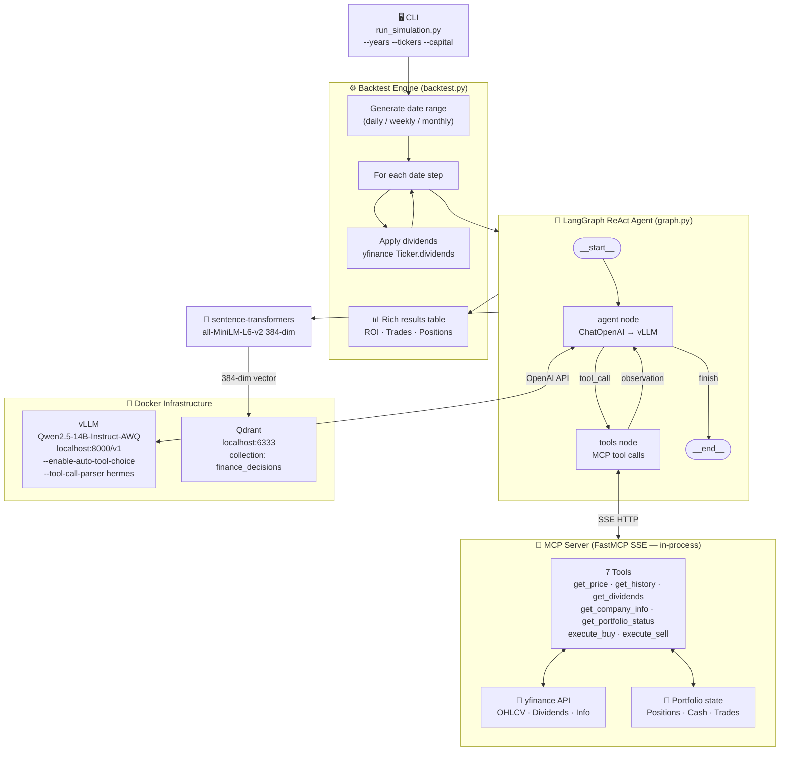

# Finance Agent — User Guide

Trading agent that simulates buying/selling stocks using **yfinance**, **MCP (FastMCP)**, **vLLM (local)** and **Qdrant**.

---

## Requirements

| Component | Requirement |
|---|---|
| Python | 3.12 (venv at `../RAG-CVs/.venv`) |
| NVIDIA GPU | ≥ 24 GB VRAM (for Qwen 32B AWQ) |
| Docker + nvidia-container-toolkit | for vLLM and Qdrant |

---

## Getting Started

### 1. Infrastructure (once)

```bash
# Start Qdrant and vLLM
docker compose up qdrant vllm -d

# Verify vLLM is ready (~10 min the first time, downloads the model)
curl http://localhost:8000/health
```

> **Note:** vLLM downloads `Qwen/Qwen2.5-32B-Instruct-AWQ` (~20 GB) on first start.  
> Subsequent runs use the cache in the Docker volume `hf_cache`.

### 2. Environment variables

```bash
cp .env.example .env
# Edit .env if you want to change defaults (tickers, capital, years, etc.)
```

Main variables in `.env`:

| Variable | Default | Description |
|---|---|---|
| `VLLM_BASE_URL` | `http://localhost:8000/v1` | vLLM endpoint |
| `QDRANT_URL` | `http://localhost:6333` | Qdrant endpoint |
| `MODEL_NAME` | `Qwen/Qwen2.5-32B-Instruct-AWQ` | Model to use |
| `TICKERS` | `AAPL,TSLA,MSFT,GOOGL,NVDA` | Default stocks |
| `INITIAL_CAPITAL` | `10000.0` | Initial capital in USD |
| `YEARS` | `3` | Simulation years |
| `BACKTEST_INTERVAL` | `1wk` | Interval between steps |

---

## Running a simulation

```bash
# Activate the venv
source /home/rodrigo/Desktop/maestria/RAG-CVs/.venv/bin/activate

# Basic simulation (1 year, monthly, 3 tickers)
python run_simulation.py --years 1 --interval 1mo --tickers AAPL MSFT NVDA

# Full simulation (3 years, weekly, 5 tickers, 50k capital)
python run_simulation.py --years 3 --interval 1wk --tickers AAPL TSLA MSFT GOOGL NVDA --capital 50000

# Show available options
python run_simulation.py --help
```

### CLI Parameters

| Argument | Default | Description |
|---|---|---|
| `--tickers` | (from .env) | List of tickers, e.g. `AAPL MSFT NVDA` |
| `--years` | 3 | Years of backtest backwards |
| `--capital` | 10000 | Initial capital in USD |
| `--interval` | `1wk` | Interval: `1d` `1wk` `1mo` |
| `--log-level` | `WARNING` | Verbosity: `DEBUG` `INFO` `WARNING` |

---

## Available intervals

| Value | Description | Steps in 1 year |
|---|---|---|
| `1d` | Daily | ~252 |
| `1wk` | Weekly | ~52 |
| `1mo` | Monthly | ~12 |

---

## Architecture



### LangGraph — Internal ReAct agent graph

The agent follows the **ReAct** pattern (Reason + Act) implemented with `create_react_agent` from `langgraph-prebuilt`:


- **agent node**: calls vLLM via OpenAI-compatible API. If the response contains `tool_calls`, the graph redirects to `tools`.
- **tools node**: executes each tool call against the MCP SSE server and returns the result to the agent.
- The cycle continues until the LLM produces a response without `tool_calls`.

### MCP tools available to the agent

| Tool | Description |
|---|---|
| `get_price` | Current price of a ticker |
| `get_history` | OHLCV history (N weeks) |
| `get_dividends` | Historical dividends |
| `get_company_info` | Fundamental info (sector, P/E, etc.) |
| `get_portfolio_status` | Current portfolio state |
| `execute_buy` | Buy N shares |
| `execute_sell` | Sell N shares |

---

## Check decisions in Qdrant

```bash
# Qdrant web dashboard
open http://localhost:6333/dashboard

# Collection with the decision history
curl http://localhost:6333/collections/finance_decisions
```

---

## Troubleshooting

### vLLM not responding
```bash
docker logs rag_vllm --tail 20
curl http://localhost:8000/health
```

### MCP server port busy
```bash
fuser -k 18765/tcp   # or the port shown in the error
```

### Context length exceeded (400)
Reduce `max_tokens` in `src/agent/graph.py` or use a model with more context in `docker-compose.yml`.

### Qdrant collection does not exist
It is created automatically on the first run. If there are schema errors:
```bash
curl -X DELETE http://localhost:6333/collections/finance_decisions
```
and run again.

---

## Restart infrastructure

```bash
docker compose restart vllm       # restart only vLLM
docker compose down               # stop everything (volumes preserved)
docker compose up qdrant vllm -d  # bring back up
```
